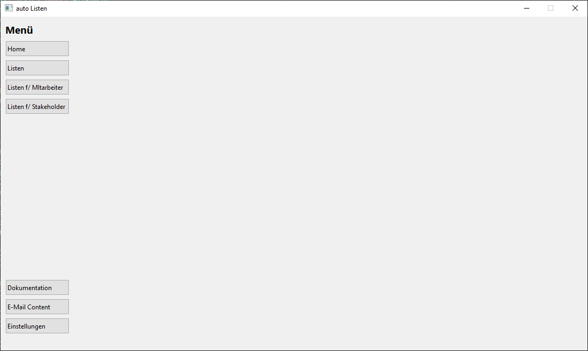
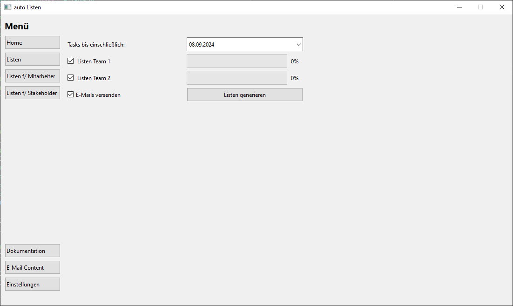
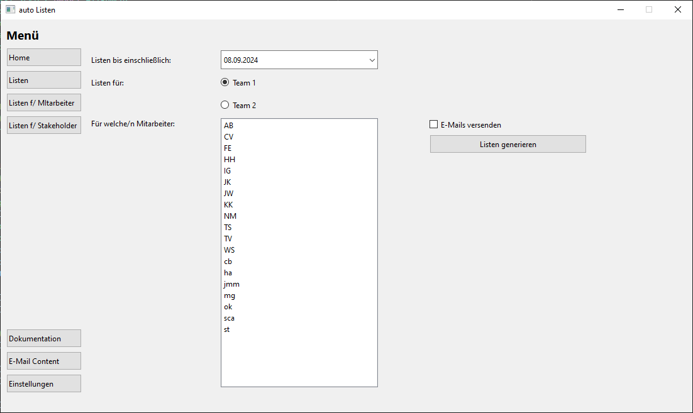
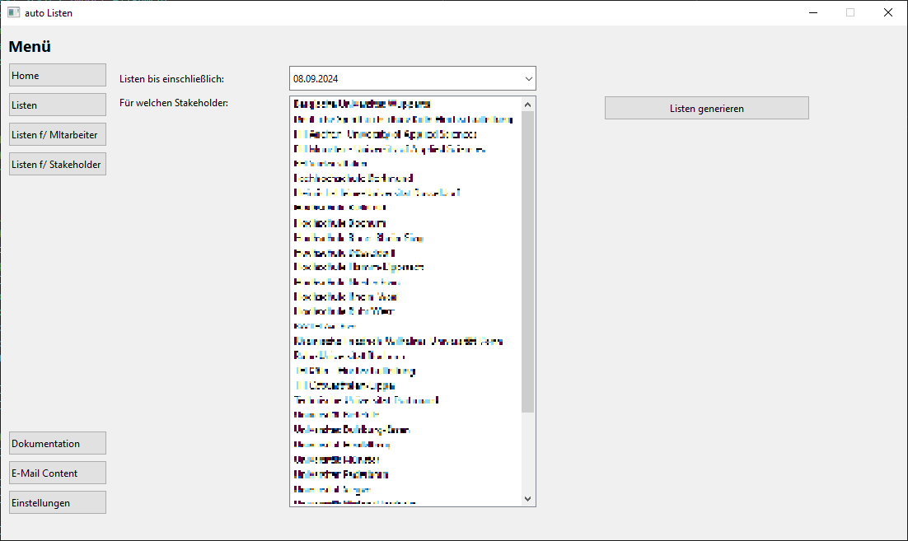
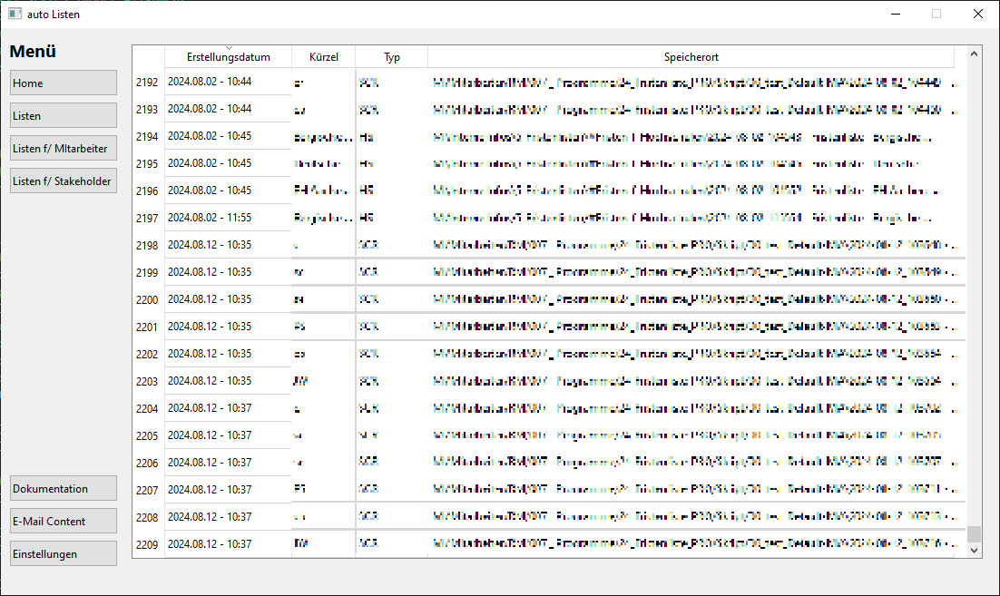
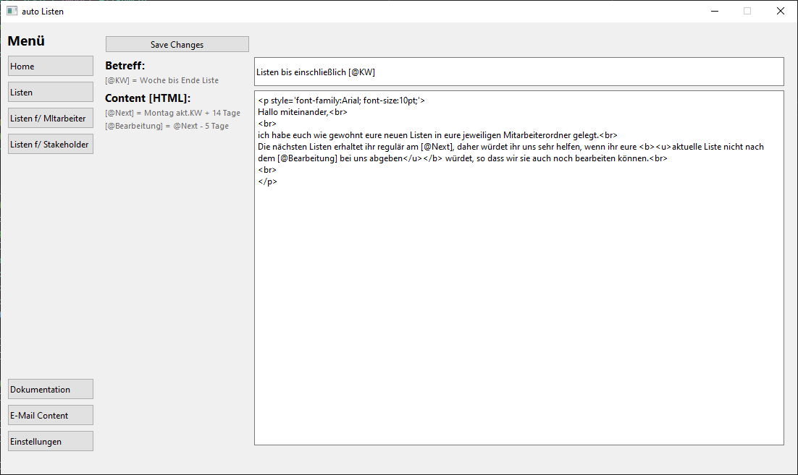
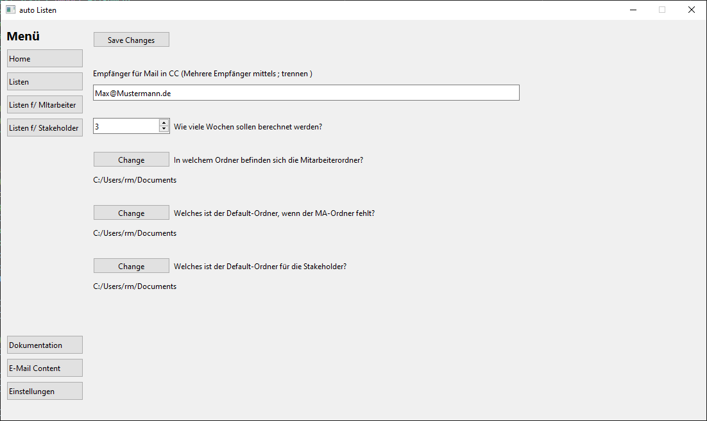

## Content
- [Reason](#reason)
- [Use](#use)
- [Licence](#licence)
- [Requirements](#requirements)

## Reason

This Project is public to be shown in my portfolio.  
Feel free to be inspired by the script.  
If you try to execute the script it will not work, since the script was written for a company and I had to censor/replace confidential components like SQL queries and Server information.  

## Use

### Home
Home side is nothing but an empty screen

### Listen
"Listen" is a process that generates a list for each employee of the selected Team, who has tasks until the selected date. It saves the file in the employees own folder.  
If selected, an E-Mail is generated with calculated dates for all employees with task lists.

### Listen f/ Mitarbeiter
"Listen f/ MA" generates task lists for all selected employees.  
First there needs a date and a team to be selected.  With this information will be a employee list provided from which can be selected.  
If selected, it also generates an E-Mail and saves the file in the employees own folder.

#### Listen f/ Stakeholder
"Listen f/ Stakeholder" generates task lists for specific Stakeholder(customer), not my employee.  
First needs a date to be selected. With this information will be a stakeholder list provided from which can be selected.  
The file will be saved in the default folder for stakeholders.

#### Documentation
This windows shows the historical documentation of previously created lists.

#### E-Mail
In this window the default E-Mail can be managed with HTML.  
There are three containers which can be used for specific calculated dates.

#### Settings
In "Einstellung" can the default settings be changed.  
First there can be added E-Mail adresses which will be in CC when creating a mail. 
Several addresses can be added, when seperated with ;  
The number indicates the default calculation for how many weeks are the tasks listed.  
The Three folder selections manage the place where the employee folders are, 
where a list is saved if no employee folder exists and where to save the stakeholder lists.

## Licence

The idea of the licence is that anyone can use this code and further develop for privat use.
Limitations apply to Liability, Warranty, etc.
see Licence for detailed information

## Requirements

### Python version

This was scripted in Python 3.12.2

### Libraries

PySide6  
datetime  
openpyxl  
pyodbc  
json  
locale  
pandas  
os  
csv  
